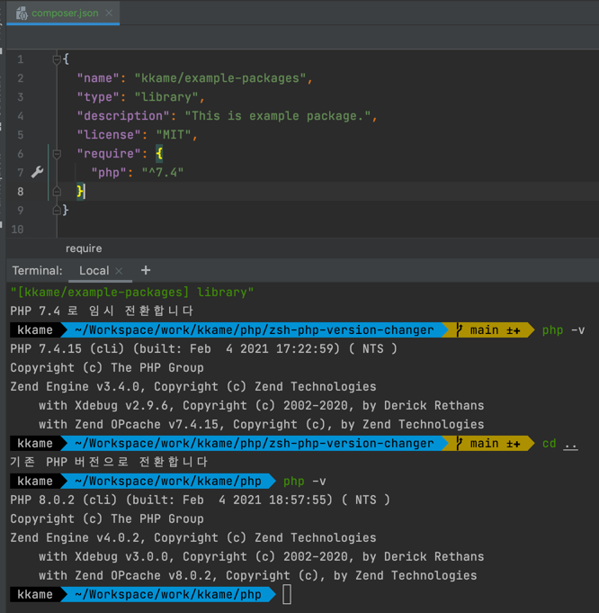
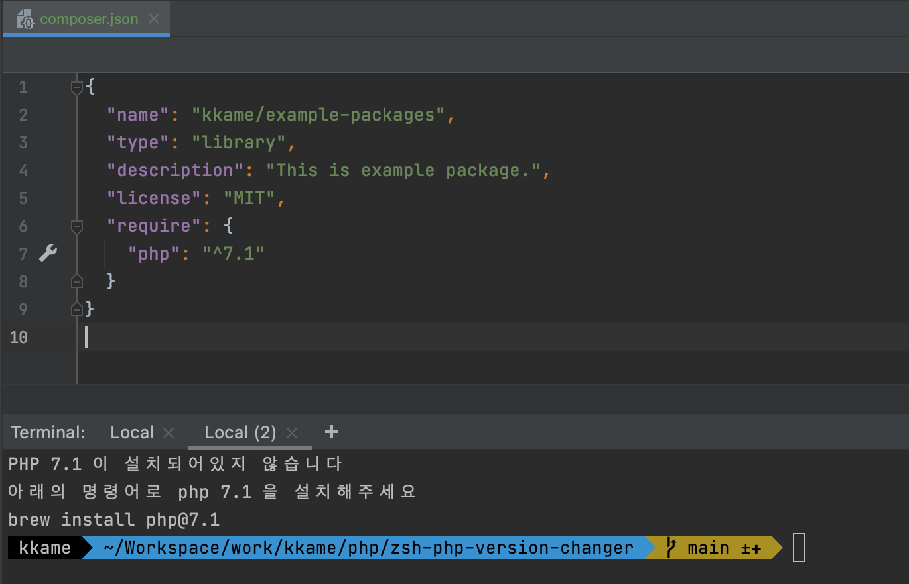

# zsh php version changer

## Preview

### change version



### suggest install



## Support OS

- macOS
- ubuntu (with ondrej ppa)

## Install

```zsh
zsh < <(curl -s -S -L https://raw.githubusercontent.com/kkame/zsh-php-version-changer/main/install.sh)
```

## 어떻게 동작하나요?

1. 터미널을 열거나 디렉토리를 이동하는 경우 해당 위치에서 composer.json 파일이 존재하는지 확인합니다.
2. composer.json에 명시된 패키지 이름을 출력합니다.
3. composer.json 에 명시된 php의 최소버전을 체크하여 OS 에 설치된 php버전에 맞도록 설정을 임시로 변경합니다.
4. 강제로 변경하고 싶다면 `pvc 7.4` 처럼 명령어와 버전명을 입력해주면 됩니다.

## How does it work

1. If you open a terminal or move a directory, check the composer.json file in that location.
2. Prints the name of the package specified in composer.json.
3. Check the minimum version of php specified in composer.json and change the setting temporarily to match
   the php version installed in OS.
4. If you want to force the change, enter the command and version name like `pvc 7.4`.
